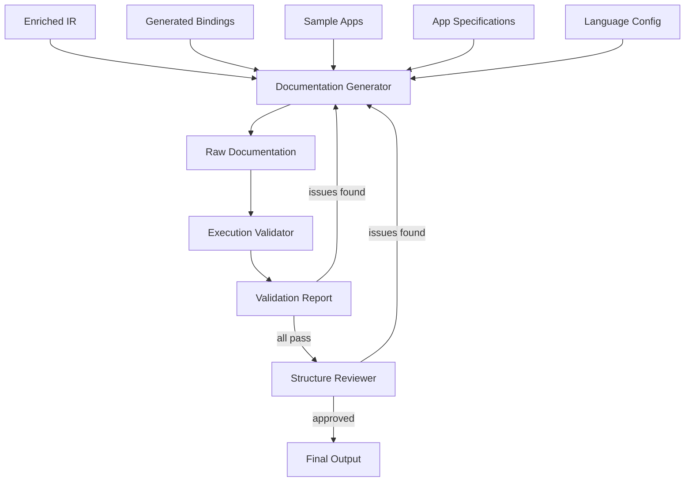

# The Great Explainer — Requirements

**Date:** 2026-03-27
**Status:** Initial draft — driven by APIAnyware-MacOS needs
**Scope:** General-purpose, but grounded in concrete first-customer requirements

## 1. Core Capabilities

### 1.1 Documentation Generation

Generate technical documentation from structured inputs (code, metadata, type information). The output should be:

- **Accurate** — matches the actual code behavior, not aspirational or outdated
- **Complete** — covers all public API surface
- **Paradigm-appropriate** — uses the conventions, terminology, and idioms of the target audience's language and paradigm
- **Cross-referenced** — links to upstream documentation (e.g., Apple developer docs) where relevant

**First-customer need:** Generate API reference documentation for macOS API bindings across 11 languages. Input is enriched IR (JSON) containing classes, methods, properties, protocols, enums, type information, provenance, and Apple doc URLs. Output is per-language API docs with examples in the appropriate binding style.

### 1.2 Tutorial Generation

Generate step-by-step tutorials from working sample applications. Each tutorial:

- Explains the "why" not just the "what"
- Introduces concepts before using them
- Builds incrementally (each step produces a visible result)
- Uses the target language's idiomatic style
- Includes complete, runnable code at each step

**First-customer need:** Generate tutorials for 8 standard sample apps (Hello Window, Counter, UI Controls Gallery, File Lister, Text Editor, Mini Browser, Menu Bar Tool, per-framework exercisers) across 11 languages and multiple paradigms. The same conceptual tutorial must be explained differently for each paradigm — a monadic Haskell tutorial is structured differently from a procedural Zig tutorial.

### 1.3 Tutorial Validation

Verify that every tutorial works as documented:

- Every code snippet compiles/runs without errors
- Every step produces the output described in the tutorial
- Steps are in the correct order (no forward references to undefined concepts)
- The final result matches the sample app specification

Validation runs in an isolated environment (container or VM) to ensure reproducibility.

**First-customer need:** Run each tutorial step in a macOS VM (via TestAnyware for GUI steps) or container, verify output matches documentation. Catch: code that doesn't compile, steps that produce wrong output, missing prerequisites, incorrect explanations.

### 1.4 User Knowledge Modelling

Model what the reader knows and what they need to learn:

- Track prerequisite knowledge (e.g., "assumes familiarity with Haskell monads")
- Identify knowledge gaps that the tutorial must fill
- Adapt explanation depth based on the target audience
- Avoid explaining what the reader already knows (don't explain what a for-loop is to an experienced programmer)

**First-customer need:** Each language target has a different assumed knowledge base. A Racket tutorial can assume Scheme familiarity. A Zig tutorial can assume systems programming knowledge. The documentation must calibrate to the audience.

### 1.5 Instructional Design Validation

Verify the pedagogical structure:

- Prerequisites before dependents
- Concepts introduced before use
- Appropriate progression from simple to complex
- No circular dependencies in explanations
- Each section has a clear learning objective

**First-customer need:** Tutorials for complex sample apps (Text Editor, Mini Browser) involve many interacting concepts (blocks, delegates, error handling, memory management). The tutorial must introduce these in the right order.

### 1.6 Multi-Stage Review Pipeline

Documentation goes through multiple stages:

```
Generate → Validate (execution) → Review (structure) → Refine → Re-validate → Publish
```

Each stage can identify issues that feed back to earlier stages. The pipeline is designed to be LLM-driven but with human review gates.

## 2. Integration Contract (APIAnyware-MacOS)

### 2.1 Inputs

| Input | Format | Source |
|-------|--------|--------|
| Enriched IR | JSON (`analysis/ir/enriched/{Framework}.json`) | APIAnyware-MacOS analysis pipeline |
| Generated bindings | Target language source files | APIAnyware-MacOS emitters |
| Sample app source | Target language source files | `generation/targets/{lang}/apps/{style}/{app}/` |
| Binding style metadata | `LanguageInfo` (id, display name, styles) | Emitter crate constants |
| App specifications | Markdown | `generation/apps/specs/{app}.md` |
| Apple doc URLs | In enriched IR `doc_refs` field | Collection phase |

### 2.2 Outputs

| Output | Format | Destination |
|--------|--------|-------------|
| API reference | Markdown/HTML | `generation/targets/{lang}/docs/api/` |
| Tutorials | Markdown/HTML | `generation/targets/{lang}/docs/tutorials/` |
| Validation reports | JSON/Markdown | `generation/targets/{lang}/docs/validation/` |

### 2.3 Per-Language Configuration

Each language target provides a documentation requirements file (`generation/targets/{lang}/docs/requirements.md`) specifying:

- Language-specific idioms and conventions
- Paradigm-appropriate explanation style
- Assumed reader knowledge
- Key concepts that need explanation
- What's unusual or surprising about the bindings

## 3. Architecture (Sketch)

This is a preliminary sketch. Detailed architecture will be designed when implementation begins.

### 3.1 Components



### 3.2 Execution Validator

Runs tutorial steps in an isolated environment:

- **Non-GUI steps** — run in a container with the target language installed
- **GUI steps** — run in a macOS VM via TestAnyware (screenshot-driven verification)
- **Output comparison** — expected output is embedded in the tutorial; validator runs the step and compares

### 3.3 Paradigm Adaptation

The same conceptual content is presented differently for different paradigms:

| Concept | OO presentation | Functional presentation | Monadic presentation |
|---------|----------------|------------------------|---------------------|
| Creating a window | "Create an NSWindow instance and set its properties" | "Call make-window with configuration parameters" | "Use `withWindow` bracket to manage the window lifecycle" |
| Handling events | "Implement the delegate protocol" | "Pass callback functions to the event registration" | "Subscribe to the event stream in the IO monad" |
| Error handling | "Check the error parameter after the call" | "Pattern match on the Result value" | "Use the ExceptT transformer" |

The adaptation engine must understand each paradigm's conventions deeply enough to produce natural-sounding documentation — not mechanical translations.

## 4. Non-Requirements (Initially)

- **Rendering/publishing** — The Great Explainer generates content (Markdown, structured data). Turning that into a website, PDF, or other format is a separate concern.
- **Version control integration** — documentation updates in response to code changes are a future capability.
- **Interactive tutorials** — initial output is static documentation. Interactive notebooks or REPLs are a future extension.
- **Natural language translation** — English only initially.

## 5. Success Criteria

For the first customer (APIAnyware-MacOS):

1. Given a completed language target (emitter + runtime + sample apps), The Great Explainer can generate API reference documentation without manual intervention
2. Generated tutorials for each sample app are validated to work (every step executes correctly)
3. Documentation is paradigmatically appropriate (a Haskell expert would find the Haskell docs natural to read)
4. Cross-references to Apple documentation are correct and functional
5. The multi-stage pipeline catches errors that a single-pass generator would miss

For the general product:

1. The system works with any programming language, not just the 11 APIAnyware targets
2. The knowledge modelling adapts explanation depth to different audiences
3. The validation pipeline catches real errors (not just false positives)
4. The instructional design validation produces meaningful feedback on tutorial structure
